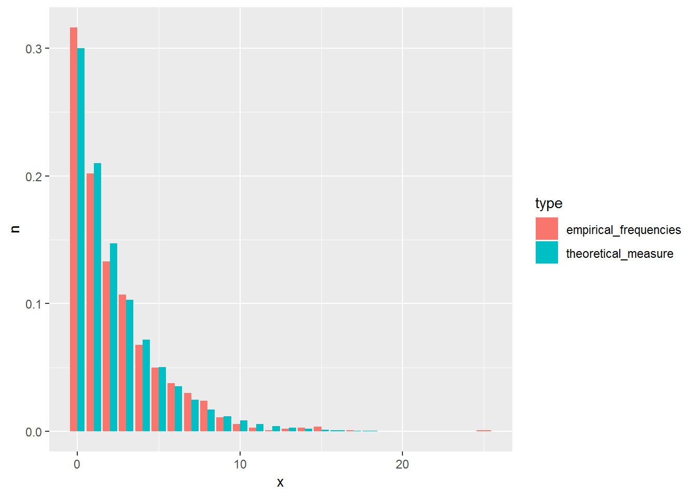

# Random variables {#rvs}

This chapter deals with random variables.

The students are expected to acquire the following knowledge:

**Theoretical**

- 

**R**

- sampling from distributions
- calculating PDF, CDF, and quantile functions
- plotting results
- facet wrap


## Identifying random variables
\BeginKnitrBlock{exercise}<div class="exercise"><span class="exercise" id="exr:unnamed-chunk-2"><strong>(\#exr:unnamed-chunk-2) </strong></span>Which of the functions below are valid CDFs? Find their respective densities.
<span style="color:blue">R: Plot the three functions.</span>
  
a. 
\begin{equation}
  F(x) = \begin{cases}
            1 - e^{-x^2} & x \geq 0    \\
            0 & x < 0.
          \end{cases}
\end{equation}
            
b. 
\begin{equation}
  F(x) = \begin{cases}
           e^{-\frac{1}{x}}, & x > 0    \\
            0, & x \leq 0.
          \end{cases}
\end{equation}
            
c. 
\begin{equation}
  F(x) = \begin{cases}
           0 & x \leq 0 \\
           \frac{1}{3} & 0 < x \leq \frac{1}{2} \\
           1 & x > \frac{1}{2}.
         \end{cases}
\end{equation}

</div>\EndKnitrBlock{exercise}
\BeginKnitrBlock{solution}<div class="solution">\iffalse{} <span class="solution"><em>Solution. </em></span>  \fi{}

a. Yes.
  - First, let us check the limits. 
    $\lim_{x \rightarrow -\infty} (0) = 0$.
    $\lim_{x \rightarrow \infty} (1 - e^{-x^2}) = 1 - 
    \lim_{x \rightarrow \infty} e^{-x^2} = 1 - 0 = 1$.
  - Second, let us check whether the function is increasing. Let $x > y \geq 0$.
    Then $1 - e^{-x^2} \geq 1 - e^{-y^2}$.
  - We only have to check right continuity for the point zero. $F(0) = 0$ and
    $\lim_{\epsilon \downarrow 0}F (0 + \epsilon) = 
      \lim_{\epsilon \downarrow 0} 1 - e^{-\epsilon^2} =
       1 - \lim_{\epsilon \downarrow 0} e^{-\epsilon^2} =
      1 - 1 = 0$.
    - We get the density by differentiating the CDF. 
  $p(x) = \frac{d}{dx} 1 - e^{-x^2} = 2xe^{-x^2}.$ Students are encouraged to
  check that this is a proper PDF.
  

b. Yes.
  - First, let us check the limits. 
    $\lim_{x \rightarrow -\infty} (0) = 0 and 
    $\lim_{x \rightarrow \infty} (e^{-\frac{1}{x}}) = 1$.
  - Second, let us check whether the function is increasing. Let $x > y \geq 0$.
    Then $e^{-\frac{1}{x}} \geq e^{-\frac{1}{y}}$.
  - We only have to check right continuity for the point zero. $F(0) = 0$ and
    $\lim_{\epsilon \downarrow 0}F (0 + \epsilon) = 
      \lim_{\epsilon \downarrow 0} e^{-\frac{1}{\epsilon}} = 0$.
  - We get the density by differentiating the CDF. 
  $p(x) = \frac{d}{dx} e^{-\frac{1}{x}} = \frac{1}{x^2}e^{-\frac{1}{x}}.$ 
      Students are encouraged to
  check that this is a proper PDF.

c. No. The function is not right continuous as $F(\frac{1}{2}) = \frac{1}{3}$,
but $\lim_{\epsilon \downarrow 0} F(\frac{1}{2} + \epsilon) = 1$.
</div>\EndKnitrBlock{solution}

```r
f1 <- function (x) {
  tmp        <- 1 - exp(-x^2)
  tmp[x < 0] <- 0
  return(tmp)
}

f2 <- function (x) {
  tmp         <- exp(-(1 / x))
  tmp[x <= 0] <- 0
  return(tmp)
}

f3 <- function (x) {
  tmp           <- x
  tmp[x == x]   <- 1
  tmp[x <= 0.5] <- 1/3
  tmp[x <= 0]   <- 0
  return(tmp)
}

cdf_data <- tibble(x  = seq(-1, 20, by = 0.01),
                   f1 = f1(x),
                   f2 = f2(x),
                   f3 = f3(x)) %>%
  melt(id.vars = "x")

# geo_plot <- ggplot(data = data.frame(x = seq(-1, 10, by = 0.01)), aes(x = x)) +
#   stat_function(aes(color = "f1"), fun = f1) +
#   stat_function(aes(color = "f2"), fun = f2) +
#   stat_function(aes(color = "f3"), fun = f3) +
#   geom_hline(yintercept = 1)
# plot(geo_plot)

geo_plot <- ggplot(data = cdf_data, aes(x = x, y = value, color = variable)) +
  geom_step() +
  geom_hline(yintercept = 1)
plot(geo_plot)
```


\BeginKnitrBlock{exercise}<div class="exercise"><span class="exercise" id="exr:unnamed-chunk-5"><strong>(\#exr:unnamed-chunk-5) </strong></span><span style="color:red">TODO: Mixed random variable CDF, find
PDF.</span>

</div>\EndKnitrBlock{exercise}
\BeginKnitrBlock{solution}<div class="solution">\iffalse{} <span class="solution"><em>Solution. </em></span>  \fi{}</div>\EndKnitrBlock{solution}

```r
f1 <- function (x) {
  tmp        <- 1 - exp(-x^2)
  tmp[x < 0] <- 0
  return(tmp)
}
```

## Discrete random variables
\BeginKnitrBlock{exercise}\iffalse{-91-66-105-110-111-109-105-97-108-32-114-97-110-100-111-109-32-118-97-114-105-97-98-108-101-93-}\fi{}<div class="exercise"><span class="exercise" id="exr:bincdf"><strong>(\#exr:bincdf)  \iffalse (Binomial random variable) \fi{} </strong></span>
<span style="color:red">TODO</span>
</div>\EndKnitrBlock{exercise}
\BeginKnitrBlock{solution}<div class="solution">\iffalse{} <span class="solution"><em>Solution. </em></span>  \fi{}

a.</div>\EndKnitrBlock{solution}


\BeginKnitrBlock{exercise}\iffalse{-91-71-101-111-109-101-116-114-105-99-32-114-97-110-100-111-109-32-118-97-114-105-97-98-108-101-93-}\fi{}<div class="exercise"><span class="exercise" id="exr:geocdf"><strong>(\#exr:geocdf)  \iffalse (Geometric random variable) \fi{} </strong></span>A variable with PMF $p(1-p)^k$ is a geometric random 
variable with support in non-negative integers. It has one positive parameter 
$p$.

a. Derive the CDF of a geometric random variable.

b. <span style="color:blue">R: Draw 1000 samples from the geometric
distribution with $p$ = 0.3$ and compare their frequencies to
theoretical values.</span>
</div>\EndKnitrBlock{exercise}
\BeginKnitrBlock{solution}<div class="solution">\iffalse{} <span class="solution"><em>Solution. </em></span>  \fi{}

a.
\begin{align}
  P(X <= k) &= \sum_{i = 0}^k p(1-p)^i \\
            &= p \sum_{i = 0}^k (1-p)^i \\
            &= p \frac{1 - (1-p)^{k+1}}{1 - (1 - p)} \\
            &= 1 - (1-p)^{k + 1}
\end{align}
</div>\EndKnitrBlock{solution}

```r
set.seed(1)
geo_samp <- rgeom(n = 1000, prob = 0.3)
geo_samp <- data.frame(x = geo_samp) %>%
  count(x) %>%
  mutate(n = n / 1000, type = "empirical_frequencies") %>%
  bind_rows(data.frame(x = 0:20, n = dgeom(0:20, prob = 0.3), type = "theoretical_measure"))

geo_plot <- ggplot(data = geo_samp, aes(x = x, y = n, fill = type)) +
  geom_bar(stat="identity", position = "dodge")
plot(geo_plot)
```


\BeginKnitrBlock{exercise}\iffalse{-91-80-111-105-115-115-111-110-32-114-97-110-100-111-109-32-118-97-114-105-97-98-108-101-93-}\fi{}<div class="exercise"><span class="exercise" id="exr:unnamed-chunk-11"><strong>(\#exr:unnamed-chunk-11)  \iffalse (Poisson random variable) \fi{} </strong></span>A variable with PMF $\frac{\lambda^k e^{-\lambda}}{k!}$ is a Poisson random 
variable with support in non-negative integers. It has one positive parameter 
$\lambda$, 
which also represents its mean value. 
This distribution is usually the default choice for modeling counts. We have
already encountered a Poisson random variable in exercise \@ref(exr:geopoispmf),
where we also sampled from this distribution.

The CDF of a Poisson random variable is $P(X <= x) = e^{-\lambda} \sum_{i=0}^x \frac{\lambda^{i}}{i!}$.

a. <span style="color:blue">R: Draw 1000 samples from the geometric
distribution with $p$ = 0.3$ and compare their frequencies to
theoretical values.</span>
</div>\EndKnitrBlock{exercise}

```r
set.seed(1)
pois_samp <- rpois(n = 1000, lambda = 5)
pois_samp <- data.frame(x = pois_samp)
pois_plot <- ggplot(data = pois_samp, aes(x = x, colour = "ECDF")) +
  stat_ecdf(geom = "step") +
  stat_function(data = data.frame(x = 0:17), aes(x = x, colour = "CDF"), geom = "line", fun = ppois, args = list(lambda = 5)) +
  scale_colour_manual("Lgend title", values = c("black", "red"))
plot(pois_plot)
```


\BeginKnitrBlock{exercise}\iffalse{-91-110-101-103-97-116-105-118-101-32-98-105-110-111-109-105-97-108-32-114-97-110-100-111-109-32-118-97-114-105-97-98-108-101-93-}\fi{}<div class="exercise"><span class="exercise" id="exr:negbincdf"><strong>(\#exr:negbincdf)  \iffalse (negative binomial random variable) \fi{} </strong></span>
<span style="color:red">TODO</span>
</div>\EndKnitrBlock{exercise}
\BeginKnitrBlock{solution}<div class="solution">\iffalse{} <span class="solution"><em>Solution. </em></span>  \fi{}

a.</div>\EndKnitrBlock{solution}

## Continuous random variables
\BeginKnitrBlock{exercise}\iffalse{-91-69-120-112-111-110-101-110-116-105-97-108-32-114-97-110-100-111-109-32-118-97-114-105-97-98-108-101-93-}\fi{}<div class="exercise"><span class="exercise" id="exr:expcdf"><strong>(\#exr:expcdf)  \iffalse (Exponential random variable) \fi{} </strong></span>A variable $X$ with PDF $\lambda e^{-\lambda x}$ is an exponential random 
variable with support in non-negative real numbers. It has one positive 
parameter $\lambda$. 
\begin{equation}
  X | \lambda \sim \text{Exp}(\lambda)
\end{equation}

a. Derive the CDF of an exponential random variable.

b. Derive the quantile function of an exponential random variable.

c. Calculate the probability $P(1 \leq X \leq 3)$, where $X \sim \text{Exp(1.5)}$.

d. <span style="color:blue">R: Check your answer to c) with a
simulation (_rexp_). Plot the probability in a meaningful way.</span>
  
e. <span style="color:blue">R: Implement PDF, CDF, and the quantile
function and compare their values with corresponding R
functions visually. Hint: use BOLD line.</span>
</div>\EndKnitrBlock{exercise}
\BeginKnitrBlock{solution}<div class="solution">\iffalse{} <span class="solution"><em>Solution. </em></span>  \fi{}

a.
\begin{align}
  F(x) &= \int_{0}^{x} \lambda e^{-\lambda t} dt \\
       &= \lambda \int_{0}^{x} e^{-\lambda t} dt \\
       &= \lambda (\frac{1}{-\lambda}e^{-\lambda t} |_{0}^{x}) \\
       &= \lambda(\frac{1}{\lambda} - \frac{1}{\lambda} e^{-\lambda x}) \\
       &= 1 - e^{-\lambda x}.
\end{align}

b.
\begin{align}
  F(F^{-1}(x))               &= x \\
  1 - e^{-\lambda F^{-1}(x)} &= x \\
  e^{-\lambda F^{-1}(x)}     &= 1 - x \\
  -\lambda F^{-1}(x)         &= \ln(1 - x) \\
  F^{-1}(x)                  &= - \frac{ln(1 - x)}{\lambda}.
\end{align}

c. 
\begin{align}
  P(1 \leq X \leq 3) &= P(X  \leq 3) - P(X \leq 1) \\
                     &= P(X \leq 3) - P(X \leq 1) \\
                     &= 1 - e^{-1.5 \times 3} - 1 + e^{-1.5 \times 1} \\
                     &\approx 0.212.
\end{align}
</div>\EndKnitrBlock{solution}

```r
set.seed(1)
nsamps <- 1000
samps  <- rexp(nsamps, rate = 1.5)
sum(samps >= 1 & samps <= 3) / nsamps
```

```
## [1] 0.212
```

```r
exp_plot <- ggplot(data.frame(x = seq(0, 5, by = 0.01)), aes(x = x)) +
  stat_function(fun = dexp, args = list(rate = 1.5)) +
  stat_function(fun = dexp, args = list(rate = 1.5), xlim = c(1,3), geom = "area", fill = "red")
plot(exp_plot)
```


```r
exp_pdf <- function(x, lambda) {
  return (lambda * exp(-lambda * x))
}

exp_cdf <- function(x, lambda) {
  return (1 - exp(-lambda * x))
}

exp_quant <- function(q, lambda) {
  return (-(log(1 - q) / lambda))
}

ggplot(data = data.frame(x = seq(0, 5, by = 0.01)), aes(x = x)) +
  stat_function(fun = dexp, args = list(rate = 1.5), aes(color = "R"), size = 2.5) +
  stat_function(fun = exp_pdf, args = list(lambda = 1.5), aes(color = "Mine"), size = 1.2) +
  scale_color_manual(values = c("red", "black"))
```


```r
ggplot(data = data.frame(x = seq(0, 5, by = 0.01)), aes(x = x)) +
  stat_function(fun = pexp, args = list(rate = 1.5), aes(color = "R"), size = 2.5) +
  stat_function(fun = exp_cdf, args = list(lambda = 1.5), aes(color = "Mine"), size = 1.2) +
  scale_color_manual(values = c("red", "black"))
```


```r
ggplot(data = data.frame(x = seq(0, 1, by = 0.01)), aes(x = x)) +
  stat_function(fun = qexp, args = list(rate = 1.5), aes(color = "R"), size = 2.5) +
  stat_function(fun = exp_quant, args = list(lambda = 1.5), aes(color = "Mine"), size = 1.2) +
  scale_color_manual(values = c("red", "black"))
```


\BeginKnitrBlock{exercise}\iffalse{-91-71-97-109-109-97-32-114-97-110-100-111-109-32-118-97-114-105-97-98-108-101-93-}\fi{}<div class="exercise"><span class="exercise" id="exr:gammapdf"><strong>(\#exr:gammapdf)  \iffalse (Gamma random variable) \fi{} </strong></span>Let $X_i \sim \text{Exp}(\lambda), i = 1,...,n$.

a. Find the PDF of $\sum_{i=1}^n X_i$.

<span style="color:red">TODO</span></div>\EndKnitrBlock{exercise}
\BeginKnitrBlock{solution}<div class="solution">\iffalse{} <span class="solution"><em>Solution. </em></span>  \fi{}

a.
</div>\EndKnitrBlock{solution}

```r
set.seed(1)
```


\BeginKnitrBlock{exercise}\iffalse{-91-66-101-116-97-32-114-97-110-100-111-109-32-118-97-114-105-97-98-108-101-93-}\fi{}<div class="exercise"><span class="exercise" id="exr:betacdf"><strong>(\#exr:betacdf)  \iffalse (Beta random variable) \fi{} </strong></span>A variable $X$ with PDF 
$\frac{x^{\alpha - 1} (1 - x)^{\beta - 1}}{\text{B}(\alpha, \beta)}$,
where $\text{B}(\alpha, \beta) = \frac{\Gamma(\alpha) \Gammma(\beta)}{\Gamma(\alpha + \beta)}$
  is a Beta random 
variable with support on $[0,1]$. It has two positive 
parameters $\alpha$ and $\beta$. 
\begin{equation}
  X | \alpha, \beta \sim \text{Beta}(\alpha, \beta)
\end{equation}
It is usually used in modeling rates.
<span style="color:red">TODO: CDF</span>

a. Calculate the PDF for $\alpha = 1$ and $\beta = 1$. What do you notice?

b. <span style="color:blue">R: Plot densities of the beta distribution
for $\alpha = 0.5$, $\beta = 0.5$, $\alpha = 4$, $\beta = 1$, $\alpha = 1$, $\beta = 4$, $alpha = 0.1$, $\beta = 0.1$.</span>

c. <span style="color:blue">R: Sample from $X \sim \text{Beta}(2, 5)$ and
compare the histogram with Beta PDF.</span>
</div>\EndKnitrBlock{exercise}
\BeginKnitrBlock{solution}<div class="solution">\iffalse{} <span class="solution"><em>Solution. </em></span>  \fi{}

a. 

</div>\EndKnitrBlock{solution}

```r
set.seed(1)
ggplot(data = data.frame(x = seq(0, 1, by = 0.01)), aes(x = x)) +
  stat_function(fun = dbeta, args = list(shape1 = 2, shape2 = 2), aes(color = "alpha = 0.5")) +
  stat_function(fun = dbeta, args = list(shape1 = 4, shape2 = 1), aes(color = "alpha = 4")) +
  stat_function(fun = dbeta, args = list(shape1 = 1, shape2 = 4), aes(color = "alpha = 1")) +
  stat_function(fun = dbeta, args = list(shape1 = 2, shape2 = 5), aes(color = "alpha = 25")) +
  stat_function(fun = dbeta, args = list(shape1 = 0.1, shape2 = 0.1), aes(color = "alpha = 0.1"))
```


```r
set.seed(1)
nsamps <- 1000
samps  <- rbeta(nsamps, 2, 5)
ggplot(data = data.frame(x = samps), aes(x = x)) +
  geom_histogram(aes(y = ..density..), color = "black") +
  stat_function(data  = data.frame(x = seq(0, 1, by = 0.01)), aes(x = x), 
                fun   = dbeta, 
                args  = list(shape1 = 2, shape2 = 5), 
                color = "red", 
                size  = 1.2)
```


\BeginKnitrBlock{exercise}\iffalse{-91-85-110-105-102-111-114-109-32-114-97-110-100-111-109-32-118-97-114-105-97-98-108-101-93-}\fi{}<div class="exercise"><span class="exercise" id="exr:unifpdf"><strong>(\#exr:unifpdf)  \iffalse (Uniform random variable) \fi{} </strong></span><span style="color:red">TODO</span></div>\EndKnitrBlock{exercise}
\BeginKnitrBlock{solution}<div class="solution">\iffalse{} <span class="solution"><em>Solution. </em></span>  \fi{}

a.
</div>\EndKnitrBlock{solution}

```r
set.seed(1)
```


\BeginKnitrBlock{exercise}\iffalse{-91-78-111-114-109-97-108-32-114-97-110-100-111-109-32-118-97-114-105-97-98-108-101-93-}\fi{}<div class="exercise"><span class="exercise" id="exr:normalpdf"><strong>(\#exr:normalpdf)  \iffalse (Normal random variable) \fi{} </strong></span><span style="color:red">TODO</span></div>\EndKnitrBlock{exercise}
\BeginKnitrBlock{solution}<div class="solution">\iffalse{} <span class="solution"><em>Solution. </em></span>  \fi{}

a.
</div>\EndKnitrBlock{solution}

```r
set.seed(1)
```


\BeginKnitrBlock{exercise}\iffalse{-91-76-111-103-105-115-116-105-99-32-114-97-110-100-111-109-32-118-97-114-105-97-98-108-101-93-}\fi{}<div class="exercise"><span class="exercise" id="exr:logitpdf"><strong>(\#exr:logitpdf)  \iffalse (Logistic random variable) \fi{} </strong></span><span style="color:red">TODO</span></div>\EndKnitrBlock{exercise}
\BeginKnitrBlock{solution}<div class="solution">\iffalse{} <span class="solution"><em>Solution. </em></span>  \fi{}

a.
</div>\EndKnitrBlock{solution}

```r
set.seed(1)
```

## Transformations
