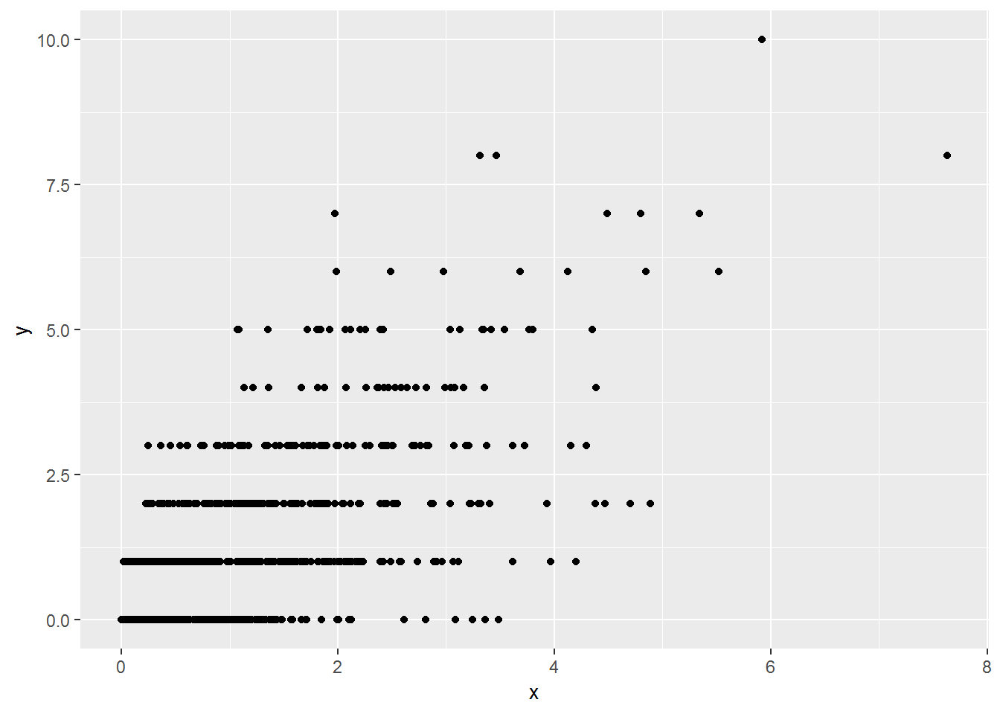

# Multiple random variables {#mrvs}

This chapter deals with multiple random variables and their distributions.

The students are expected to acquire the following knowledge:

**Theoretical**

- Connection between the binomial and multinomial distribution.
- Calculation of PDF of transformed multiple random variables.
- Finding marginal and conditional distributions.

**R**

- Scatterplots of bivariate random variables.
- Sampling from the multinomial distribution.
- Sampling from transformed bivariate random variables.
- New R functions (for example, _expand.grid_).
- New ggplot parameters (for example, _alpha_ for transparency).
- Transparency in ggplot.


## General
\BeginKnitrBlock{exercise}<div class="exercise"><span class="exercise" id="exr:unnamed-chunk-2"><strong>(\#exr:unnamed-chunk-2) </strong></span><span style="color:blue">Let $X \sim \text{N}(0,1)$ and $Y \sim \text{N}(0,1)$ 
be independent random
variables. Draw 1000 samples from $(X,Y)$ and plot a scatterplot.
Now let $X \sim \text{N}(0,1)$ and $Y | X = x \sim N(ax, 1). Draw 1000 samples
from $(X,Y)$ for $a = 1$, $a=0$, and $a=-0.5$. Plot the scatterplots.
How would you interpret parameter $a$?
Plot the marginal distribution of $Y$ for cases $a=1$, $a=0$, and $a=-0.5$.
Can you guess which distribution it is?</span>

</div>\EndKnitrBlock{exercise}

```r
set.seed(1)
nsamps <- 1000
x      <- rnorm(nsamps)
y      <- rnorm(nsamps)
ggplot(data.frame(x, y), aes(x = x, y = y)) +
  geom_point()
```


```r
y1 <- rnorm(nsamps, mean = 1 * x)
y2 <- rnorm(nsamps, mean = 0 * x)
y3 <- rnorm(nsamps, mean = -0.5 * x)
df <- tibble(x = c(x,x,x),
             y = c(y1,y2,y3),
             a = c(rep(1, nsamps), rep(0, nsamps), rep(-0.5, nsamps)))
ggplot(df, aes(x = x, y = y)) +
  geom_point() +
  facet_wrap(~a) +
  coord_equal(ratio=1)
```


```r
# Parameter a controls the scale of linear dependency between X and Y.

ggplot(df, aes(x = y)) +
  geom_density() +
  facet_wrap(~a)
```


## Bivariate distribution examples
\BeginKnitrBlock{exercise}\iffalse{-91-68-105-115-99-114-101-116-101-32-98-105-118-97-114-105-97-116-101-32-114-97-110-100-111-109-32-118-97-114-105-97-98-108-101-93-}\fi{}<div class="exercise"><span class="exercise" id="exr:unnamed-chunk-4"><strong>(\#exr:unnamed-chunk-4)  \iffalse (Discrete bivariate random variable) \fi{} </strong></span>Let $X$ represent the event that a die rolls an even number and let $Y$ 
represent the event that
a die rolls one, two, or a three.

a. Find the marginal distributions of $X$ and $Y$.

b. Find the PMF of $(X,Y)$.

c. Find the CDF of $(X,Y)$.

d. Find $P(X = 1 | Y = 1)$.
</div>\EndKnitrBlock{exercise}
\BeginKnitrBlock{solution}<div class="solution">\iffalse{} <span class="solution"><em>Solution. </em></span>  \fi{}

a.
\begin{align}
  P(X = 1) = \frac{1}{2} \text{ and } P(X = 0) = \frac{1}{2} \\
  P(Y = 1) = \frac{1}{2} \text{ and } P(Y = 0) = \frac{1}{2} \\
\end{align}


b.
\begin{align}
  P(X = 1, Y = 1) = \frac{1}{6} \\
  P(X = 1, Y = 0) = \frac{2}{6} \\
  P(X = 0, Y = 1) = \frac{2}{6} \\
  P(X = 0, Y = 0) = \frac{1}{6}
\end{align}
  
c. 
\begin{align}
  P(X \leq x, Y \leq y) = \begin{cases}
    \frac{1}{6} & x = 0, y = 0 \\
    \frac{3}{6} & x \neq y \\
    1           & x = 1, y = 1
  \end{cases}
\end{align}

d.
\begin{align}
  P(X = 1 | Y = 1) = \frac{1}{3}
\end{align}
</div>\EndKnitrBlock{solution}


\BeginKnitrBlock{exercise}\iffalse{-91-67-111-110-116-105-110-117-111-117-115-32-98-105-118-97-114-105-97-116-101-32-114-97-110-100-111-109-32-118-97-114-105-97-98-108-101-93-}\fi{}<div class="exercise"><span class="exercise" id="exr:unnamed-chunk-6"><strong>(\#exr:unnamed-chunk-6)  \iffalse (Continuous bivariate random variable) \fi{} </strong></span>Let $p(x,y) = 6 (x - y)^2$ be the PDF of a bivariate random
variable $(X,Y)$, where both variables range from zero to one.

a. Find CDF.

b. Find marginal distributions.

c. Find conditional distributions.

d. <span style="color:blue">R: Plot a grid of points and colour them
by value -- this can help us visualize the PDF.</span>
  
d. <span style="color:blue">R: Plot the marginal distribution of $Y$ and
the conditional distributions of $X | Y = y$, where 
$y \in \{0, 0.1, 0.5\}$.</span></div>\EndKnitrBlock{exercise}
\BeginKnitrBlock{solution}<div class="solution">\iffalse{} <span class="solution"><em>Solution. </em></span>  \fi{}

a. 
\begin{align}
  F(x,y) &= \int_0^{x} \int_0^{y} 6 (t - s)^2 ds dt\\
         &= 6 \int_0^{x} \int_0^{y} t^2 - 2ts + s^2 ds dt\\
         &= 6 \int_0^{x} t^2y - ty^2 + \frac{y^3}{3} dt \\
         &= 6 (\frac{x^3 y}{3} - \frac{x^2y^2}{2} + \frac{x y^3}{3}) \\
         &= 2 x^3 y - 3 t^2y^2 + 2 x y^3
\end{align}

b. 
\begin{align}
  p(x) &= \int_0^{1} 6 (x - y)^2 dy\\
       &= 6 (x^2 - x + \frac{1}{3}) \\
       &= 6x^2 - 6x + 2
\end{align}
\begin{align}
  p(x) &= \int_0^{1} 6 (x - y)^2 dx\\
       &= 6 (y^2 - y + \frac{1}{3}) \\
       &= 6y^2 - 6y + 2
\end{align}
  
c. 
\begin{align}
  p(x|y) &= \frac{p(xy)}{p(y)} \\
         &= \frac{6 (x - y)^2}{6 (y^2 - y + \frac{1}{3})} \\
         &= \frac{(x - y)^2}{y^2 - y + \frac{1}{3}}
  \end{align}
  \begin{align}
  p(y|x) &= \frac{p(xy)}{p(x)} \\
         &= \frac{6 (x - y)^2}{6 (x^2 - x + \frac{1}{3})} \\
         &= \frac{(x - y)^2}{x^2 - x + \frac{1}{3}}
  \end{align}
</div>\EndKnitrBlock{solution}

```r
set.seed(1)

# a
get_pdf    <- function (x, y) {
  return ((x - y)^2)
}
x_axis       <- seq(0, 1, length.out = 100)
y_axis       <- seq(0, 1, length.out = 100)
df           <- expand.grid(x_axis, y_axis)
colnames(df) <- c("x", "y")
df           <- cbind(df, pdf = get_pdf(df$x, df$y))
ggplot(data = df, aes(x = x, y = y, color = pdf)) +
  geom_point()
```


```r
# b
mar_pdf <- function (x) {
  return (6 * x^2 - 6 * x + 2)
}
cond_pdf <- function (x, y) {
  return (((x - y)^2) / (y^2 - y + 1/3))
}
df <- tibble(x    = x_axis, 
             mar  = mar_pdf(x), 
             y0   = cond_pdf(x, 0), 
             y0.1 = cond_pdf(x, 0.1), 
             y0.5 = cond_pdf(x, 0.5)) %>%
  gather(dist, value, -x)
ggplot(df, aes(x = x, y = value, color = dist)) +
  geom_line()
```


\BeginKnitrBlock{exercise}\iffalse{-91-77-105-120-101-100-32-98-105-118-97-114-105-97-116-101-32-114-97-110-100-111-109-32-118-97-114-105-97-98-108-101-93-}\fi{}<div class="exercise"><span class="exercise" id="exr:unnamed-chunk-9"><strong>(\#exr:unnamed-chunk-9)  \iffalse (Mixed bivariate random variable) \fi{} </strong></span>Let $f(x,y) = \frac{\beta^{\alpha}}{\Gamma(\alpha)y!} x^{y+ \alpha -1} e^{-x(1 + \beta)}$
be the PDF of a bivariate random variable, where $x \in (0, \infty)$ and
$y \in \mathbb{N}_0$.


a. Find the marginal distribution of $X$. Do you recognize this distribution?

b. Find the conditional distribution of $Y | X$. Do you recognize this
distribution?

c. Calculate the probability $P(Y = 2 | X < 5)$ for $(X,Y)$.

d. Find the marginal distribution of $Y$. Do you recognize this distribution?

e. <span style="color:blue">R: Take 1000 random samples from $(X,Y)$ with 
parameters $\beta = 1$ and 
$\alpha = 1$. Plot a scatterplot. Plot a bar plot of the marginal distribution
of $Y$, and the theoretical PMF calculated from d) on the range from 0 to 10.
Hint: Use the __gamma__ function in R.?</span>
</div>\EndKnitrBlock{exercise}
\BeginKnitrBlock{solution}<div class="solution">\iffalse{} <span class="solution"><em>Solution. </em></span>  \fi{}

a.
\begin{align}
  p(x) &= \sum_{k = 0}^{\infty} \frac{\beta^{\alpha}}{\Gamma(\alpha)k!} x^{k + \alpha -1} e^{-x(1 + \beta)} & \\
       &= \sum_{k = 0}^{\infty} \frac{\beta^{\alpha}}{\Gamma(\alpha)k!} x^{k} x^{\alpha -1} e^{-x} e^{-\beta x} & \\
       &= \frac{\beta^{\alpha}}{\Gamma(\alpha)} x^{\alpha -1} e^{-\beta x} \sum_{k = 0}^{\infty} \frac{1}{k!} x^{k} e^{-x} & \\
       &= \frac{\beta^{\alpha}}{\Gamma(\alpha)} x^{\alpha -1} e^{-\beta x} & \text{the last term above sums to one -- Poisson PMF}
\end{align}
This is the Gamma PDF.

b.
\begin{align}
  p(y|x) &= \frac{p(x,y)}{p(x)} \\
         &= \frac{f(x,y) = \frac{\beta^{\alpha}}{\Gamma(\alpha)y!} x^{y+ \alpha -1} e^{-x(1 + \beta)}}{\frac{\beta^{\alpha}}{\Gamma(\alpha)} x^{\alpha -1} e^{-\beta x}} \\
         &= \frac{x^y e^{-x}}{y!}.
\end{align}
This is the Poisson PMF.
  
c.
\begin{align}
  P(Y = 2 | X = 2.5) = \frac{2.5^2 e^{-2.5}}{2!} \approx 0.26.
\end{align}
  
d. 
\begin{align}
  p(y) &= \int_{0}^{\infty} \frac{\beta^{\alpha}}{\Gamma(\alpha)y!} x^{y + \alpha -1} e^{-x(1 + \beta)} dx & \\
       &= \frac{1}{y!} \int_{0}^{\infty} \frac{\beta^{\alpha}}{\Gamma(\alpha)} x^{(y + \alpha) -1} e^{-(1 + \beta)x} dx & \\
       &= \frac{1}{y!} \frac{\beta^{\alpha}}{\Gamma(\alpha)} \int_{0}^{\infty} \frac{\Gamma(y + \alpha)}{(1 + \beta)^{y + \alpha}} \frac{(1 + \beta)^{y + \alpha}}{\Gamma(y + \alpha)} x^{(y + \alpha) -1} e^{-(1 + \beta)x} dx & \text{we add the term so that we have Gamma PDF inside the integral} \\
       &= \frac{1}{y!} \frac{\beta^{\alpha}}{\Gamma(\alpha)} \frac{\Gamma(y + \alpha)}{(1 + \beta)^{y + \alpha}}.
\end{align}
We add the terms in the third equality to get a Gamma PDF inside the integral, 
which then integrates to one.
We do not recognize this distribution.
</div>\EndKnitrBlock{solution}

```r
set.seed(1)
px <- function (x, alpha, beta) {
  return((1 / factorial(x)) * (beta^alpha / gamma(alpha)) * 
           (gamma(x + alpha) / (1 + beta)^(x + alpha)))
}
nsamps <- 1000
rx     <- rgamma(nsamps, 1, 1)
ryx    <- rpois(nsamps, rx)
ggplot(data = data.frame(x = rx, y = ryx), aes(x = x, y = y)) + geom_point()
```



```r
ggplot(data = data.frame(x = rx, y = ryx), aes(x = y)) + 
  geom_bar(aes(y = (..count..)/sum(..count..))) +
  stat_function(fun = px, args = list(alpha = 1, beta = 1), color = "red")
```


\BeginKnitrBlock{exercise}<div class="exercise"><span class="exercise" id="exr:unnamed-chunk-12"><strong>(\#exr:unnamed-chunk-12) </strong></span>Let $f(x,y) = cx^2y$ for $x^2 \leq y \leq 1$ and zero otherwise. 
Find such $c$ that $f$ is a PDF of a bivariate random
variable. This exercise is borrowed from Wasserman.</div>\EndKnitrBlock{exercise}
\BeginKnitrBlock{solution}<div class="solution">\iffalse{} <span class="solution"><em>Solution. </em></span>  \fi{}\begin{align}
  1 &= \int_{-1}^{1} \int_{x^2}^1 cx^2y dy dx \\
    &= \int_{-1}^{1} cx^2 (\frac{1}{2} - \frac{x^4}{2}) dx \\
    &= \frac{c}{2} \int_{-1}^{1} x^2 - x^6 dx \\
    &= \frac{c}{2} (\frac{1}{3} + \frac{1}{3} - \frac{1}{7} - \frac{1}{7}) \\
    &= \frac{c}{2} \frac{8}{21} \\
    &= \frac{4c}{21}
\end{align}
It follows $c = \frac{21}{4}$.</div>\EndKnitrBlock{solution}


## Transformations
\BeginKnitrBlock{exercise}<div class="exercise"><span class="exercise" id="exr:unnamed-chunk-14"><strong>(\#exr:unnamed-chunk-14) </strong></span>Let $(X,Y)$ be uniformly distributed on the unit ball
$\{(x,y,z) : x^2 + y^2 + z^2 \leq 1\}$. Let $R = \sqrt{X^2 + Y^2 + Z^2}$.
Find the CDF and PDF of $R$.

</div>\EndKnitrBlock{exercise}
\BeginKnitrBlock{solution}<div class="solution">\iffalse{} <span class="solution"><em>Solution. </em></span>  \fi{}\begin{align}
  P(R < r) &= P(\sqrt{X^2 + Y^2 + Z^2} < r) \\
           &= P(X^2 + Y^2 + Z^2 < r^2) \\
           &= \frac{\frac{4}{3} \pi r^2}{\frac{4}{3}\pi} \\
           &= r^3.
\end{align}
The second line shows us that we are looking at the probability which is
represented by a smaller ball with radius $r$. To get the probability, we
divide it by the radius of the whole ball. We get the PDF by differentiating
the CDF, so $p(r) = 3r^2$.
</div>\EndKnitrBlock{solution}


