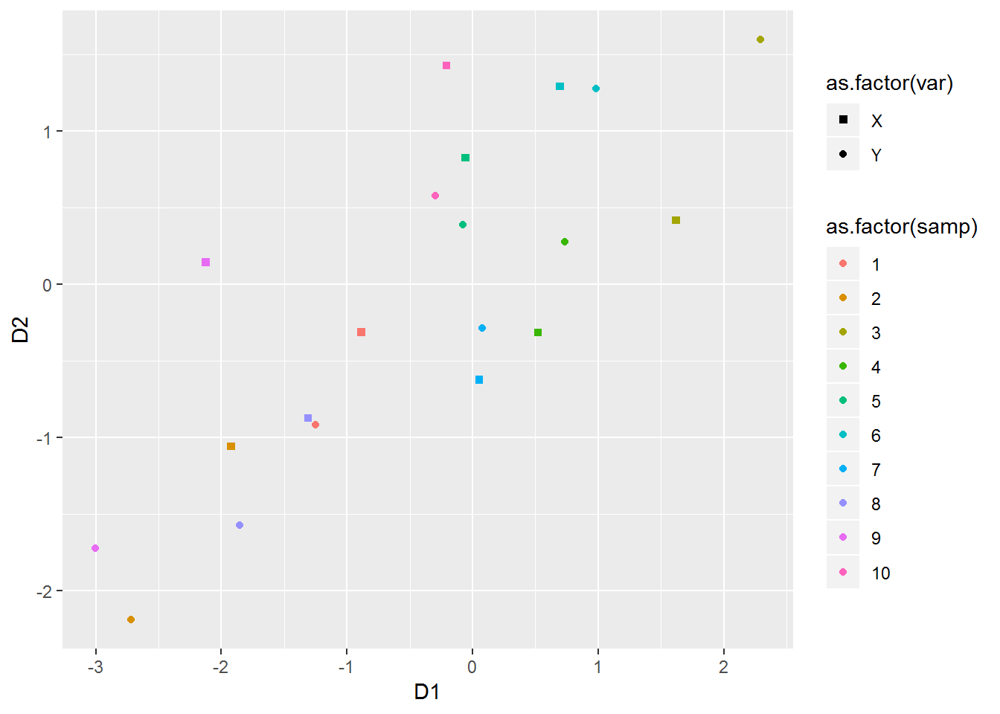
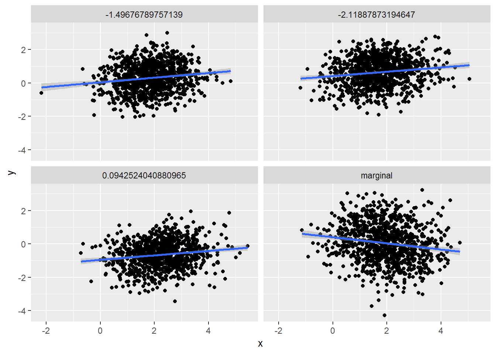

# Multivariate random variables {#mrv}

This chapter deals with multivariate random variables.

The students are expected to acquire the following knowledge:

**Theoretical**

- Multivariate normal distribution.


**R**

- Sampling from the multivariate normal distribution.


## Multinomial random variables
\BeginKnitrBlock{exercise}<div class="exercise"><span class="exercise" id="exr:mnompdf"><strong>(\#exr:mnompdf) </strong></span>Let $X_i$, $i = 1,...,k$ represent $k$ events, and $p_i$ the probabilities
of these events happening in a trial. Let $n$ be the number of trials, and
$X$ a multivariate random variable, the collection of $X_i$. 
Then $p(x) = \frac{n!}{x_1!x_2!...x_k!} p_1^{x_1} p_2^{x_2}...p_k^{x_k}$
is the PMF of a multinomial distribution, where $n = \sum_{i = 1}^k x_i$.

a. Show that the marginal distribution of $X_i$ is a binomial distribution.

b. Take 1000 samples from the multinomial distribution with $n=4$ and
probabilities $p = (0.2, 0.2, 0.5, 0.1)$. Then take 1000 samples from 
four binomial distributions with the same parameters. Inspect the results
visually.

</div>\EndKnitrBlock{exercise}
\BeginKnitrBlock{solution}<div class="solution">\iffalse{} <span class="solution"><em>Solution. </em></span>  \fi{}

a. We will approach this proof from the probabilistic point of view.
W.L.O.G. let $x_1$ be the marginal distribution we are interested in.
The term $p^{x_1}$ denotes the probability that event 1 happened $x_1$ times.
For this event not to happen, one of the other events needs to happen. So
for each of the remaining trials, the probability of another event is
$\sum_{i=2}^k p_i = 1 - p_1$, and there were $n - x_1$ such trials.
What is left to do is to calculate the number of permutations of event 1
happening and event 1 not happening. We choose $x_1$ trials, from $n$ trials.
Therefore $p(x_1) = \binom{n}{x_1} p_1^{x_1} (1 - p_1)^{n - x_1}$, which is
the binomial PMF. Interested students are encouraged to prove this 
mathematically.</div>\EndKnitrBlock{solution}

```r
set.seed(1)
nsamps      <- 1000
samps_mult  <- rmultinom(nsamps, 4, prob = c(0.2, 0.2, 0.5, 0.1))
samps_mult  <- as_tibble(t(samps_mult)) %>%
  gather()
samps       <- tibble(
  V1 = rbinom(nsamps, 4, 0.2),
  V2 = rbinom(nsamps, 4, 0.2),
  V3 = rbinom(nsamps, 4, 0.5),
  V4 = rbinom(nsamps, 4, 0.1)
) %>%
  gather() %>%
  bind_rows(samps_mult) %>%
  bind_cols("dist" = c(rep("binomial", 4*nsamps), rep("multinomial", 4*nsamps)))

ggplot(samps, aes(x = value, fill = dist)) +
  geom_bar(position = "dodge") +
  facet_wrap(~ key)
```


\BeginKnitrBlock{exercise}\iffalse{-91-77-117-108-116-105-110-111-109-105-97-108-32-101-120-112-101-99-116-101-100-32-118-97-108-117-101-93-}\fi{}<div class="exercise"><span class="exercise" id="exr:mnomev"><strong>(\#exr:mnomev)  \iffalse (Multinomial expected value) \fi{} </strong></span>Find the expected value, variance and covariance of the multinomial distribution. Hint: First find the expected value for $n = 1$ and then use the fact that the trials are independent.
</div>\EndKnitrBlock{exercise}
\BeginKnitrBlock{solution}<div class="solution">\iffalse{} <span class="solution"><em>Solution. </em></span>  \fi{}Let us first calculate the expected value of $X_1$, when $n = 1$.

\begin{align}
  E[X_1] &= \sum_{n_1 = 0}^1 \sum_{n_2 = 0}^1 ... \sum_{n_k = 0}^1 \frac{1}{n_1!n_2!...n_k!}p_1^{n_1}p_2^{n_2}...p_k^{n_k}n_1 \\
         &= \sum_{n_1 = 0}^1 \frac{p_1^{n_1} n_1}{n_1!} \sum_{n_2 = 0}^1 ... \sum_{n_k = 0}^1 \frac{1}{n_2!...n_k!}p_2^{n_2}...p_k^{n_k}
\end{align}
When $n_1 = 0$ then the whole terms is zero, so we do not need to evaluate other sums. When $n_1 = 1$, all other $n_i$ must be zero, as we have $1 = \sum_{i=1}^k n_i$. Therefore the other sums equal $1$. So $E[X_1] = p_1$ and $E[X_i] = p_i$ for $i = 1,...,k$.
Now let $Y_j$, $j = 1,...,n$, have a multinomial distribution with $n = 1$, and let $X$ have a multinomial distribution with and arbitrary $n$. Then we can write $X = \sum_{j=1}^n Y_j$. And due to independence
\begin{align}
  E[X] &= E[\sum_{j=1}^n Y_j] \\
       &= \sum_{j=1}^n E[Y_j] \\
       &= np.
\end{align}
For the variance, we need $E[X^2]$. Let us follow the same procedure as above and first calculate $E[X_i]$ for $n = 1$. The only thing that changes is that the term $n_i$ becomes $n_i^2$. Since we only have $0$ and $1$ this does not change the outcome. So
\begin{align}
  Var[X_i] &= E[X_i^2] - E[X_i]^2\\
           &= p_i(1 - p_i).
\end{align}
Analogous to above for arbitrary $n$
\begin{align}
  Var[X] &= E[X^2] - E[X]^2 \\
         &= \sum_{j=1}^n E[Y_j^2] - \sum_{j=1}^n E[Y_j]^2 \\
         &= \sum_{j=1}^n E[Y_j^2] -  E[Y_j]^2 \\
         &= \sum_{j=1}^n p(1-p) \\
         &= np(1-p).
\end{align}
To calculate the covariance, we need $E[X_i X_j]$. Again, let us start with $n = 1$. Without loss of generality, let us assume $i = 1$ and $j = 2$.
\begin{align}
  E[X_1 X_2] = \sum_{n_1 = 0}^1 \sum_{n_2 = 0}^1 \frac{p_1^{n_1} n_1}{n_1!} \frac{p_2^{n_2} n_2}{n_2!} \sum_{n_3 = 0}^1 ... \sum_{n_k = 0}^1 \frac{1}{n_3!...n_k!}p_3^{n_3}...p_k^{n_k}.
\end{align}
In the above expression, at each iteration we multiply with $n_1$ and $n_2$. Since $n = 1$, one of these always has to be zero. Therefore $E[X_1 X_2] = 0$ and
\begin{align}
  Cov(X_i, X_j) &= E[X_i X_j] - E[X_i]E[X_j] \\
                &= - p_i p_j.
\end{align}
For arbitrary $n$, let $X_1 = \sum_{k = 1}^n X_{1k}$ and $X_2 = \sum_{l = 1}^n X_{2l}$, sums of intependent multinomial random variables with $n=1$. 
\begin{align}
  Cov(X_1, X_2) &= E[X_1 X_2] - E[X_1] E[X_2] \\
                &= E[\sum_{k = 1}^n X_{1k} \sum_{l = 1}^n X_{2l}] - n^2 p_1 p_2 \\
                &= \sum_{k = 1}^n \sum_{l = 1}^n E[X_{1k} X_{2l}] - n^2 p_1 p_2.
\end{align}
For $X_1k$ and $X_2l$ the expected value is zero when $k = l$. When $k \neq l$ then they are independent, so the expected value is the product $p_1 p_2$. There are $n^2$ total terms, and for $n$ of them $k = l$ holds. So $E[X_1 X_2] = (n^2 - n) p_1 p_2$. Inserting into the above
\begin{align}
  Cov(X_1, X_2) &= (n^2 - n) p_1 p_2 - n^2 p_1 p_2 \\
                &= - n p_1 p_2.
\end{align}
</div>\EndKnitrBlock{solution}

## Multivariate normal random variables
\BeginKnitrBlock{exercise}\iffalse{-91-67-104-111-108-101-115-107-121-32-100-101-99-111-109-112-111-115-105-116-105-111-110-93-}\fi{}<div class="exercise"><span class="exercise" id="exr:mvnchol"><strong>(\#exr:mvnchol)  \iffalse (Cholesky decomposition) \fi{} </strong></span>Let $X$ be a random vector of length $k$ with $X_i \sim \text{N}(0, 1)$ and $LL^*$ the Cholesky decomposition of a Hermitian positive-definite matrix $A$. Let $\mu$ be a vector of length $k$.

a. Find the distribution of the random vector $Y = \mu + L X$. 

b. Find the Cholesky decomposition of $A = 
\begin{bmatrix} 
  2 & 1.2 \\
  1.2 & 1 
\end{bmatrix}$.

c. <span style="color:blue">R: Use the results from a) and b) to sample from the MVN distribution $\text{N}(\mu, A)$, where $\mu = [1.5, -1]^T$. Plot a scatterplot and compare it to direct samples from the multivariate normal distribution (_rmvnorm_). </span>
  
d. <span style="color:blue">R: $L$ is a linear map$. Plot 10 points from $X$ and 10 points from the transformation $L X$ (Hint: use color or shapes). Compare and discuss the results.</span></div>\EndKnitrBlock{exercise}
\BeginKnitrBlock{solution}<div class="solution">\iffalse{} <span class="solution"><em>Solution. </em></span>  \fi{}

a. $X$ has an independent normal distribution of dimension $k$. Then
\begin{align}
  Y = \mu + L X &\sim \text{N}(\mu, LL^T) \\
                &\sim \text{N}(\mu, A).
\end{align}
  
  
b.
\begin{align}
  \begin{bmatrix} 
    a & 0 \\
    b & c 
  \end{bmatrix}
  \begin{bmatrix} 
    a & b \\
    0 & c 
  \end{bmatrix} =
  \begin{bmatrix} 
    2 & 1.2 \\
    1.2 & 1 
  \end{bmatrix}
\end{align}


</div>\EndKnitrBlock{solution}

```r
# a
set.seed(1)
nsamps <- 1000
X      <- matrix(data = rnorm(nsamps * 2), ncol = 2)
mu     <- c(1.5, -1)
L      <- matrix(data = c(sqrt(2), 0,
                          1.2 / sqrt(2), sqrt(1 - 1.2^2/2)),
                 ncol  = 2,
                 byrow = TRUE)
Y      <- t(mu + L %*% t(X))
plot_df <- data.frame(rbind(X, Y), c(rep("X", nsamps), rep("Y", nsamps)))
colnames(plot_df) <- c("D1", "D2", "var")
ggplot(data = plot_df, aes(x = D1, y = D2, colour = as.factor(var))) +
  geom_point()
```


```r
# b
nsamps <- 10
X      <- matrix(data = rnorm(nsamps * 2), ncol = 2)
L      <- matrix(data = c(sqrt(2), 0,
                          1.2 / sqrt(2), sqrt(1 - 1.2^2/2)),
                 ncol  = 2,
                 byrow = TRUE)
Y      <- t(L %*% t(X))
plot_df <- data.frame(rbind(X, Y), 
                      c(rep("X", nsamps), rep("Y", nsamps)), 
                      c(1:nsamps, 1:nsamps))
colnames(plot_df) <- c("D1", "D2", "var", "samp")
ggplot(data = plot_df, aes(x = D1, 
                           y = D2, 
                           shape = as.factor(var), 
                           color = as.factor(samp))) +
  geom_point() +
  scale_shape_manual(values = c(15, 16))
```




\BeginKnitrBlock{exercise}\iffalse{-91-69-105-103-101-110-100-101-99-111-109-112-111-115-105-116-105-111-110-93-}\fi{}<div class="exercise"><span class="exercise" id="exr:mvneigen"><strong>(\#exr:mvneigen)  \iffalse (Eigendecomposition) \fi{} </strong></span><span style="color:blue">R: Let $\Sigma = U \Lambda U^T$ be the eigendecomposition of covariance matrix $\sigma$. Follow the procdeure below, to sample from a multivariate normal with $\mu = [-2, 1]^T$ and $\Sigma =
\begin{bmatrix} 
  0.3, -0.5 \\
  -0.5, 1.6 
\end{bmatrix}$:</span>

1. <span style="color:blue">Sample from two independent standardized normal distributions to get $X$.</span>
  
2. <span style="color:blue">Find the eigen decomposition of $X$ (_eigen_).</span>

3. <span style="color:blue">Multiply $X$ by $\Lambda^{\frac{1}{2}}$ to get $X2$. Consider how the eigendecomposition for $X2$ changes compared to $X$. </span>
    
4. <span style="color:blue">Multiply $X2$ by $U$ to get $X3$. Consider how the eigendecomposition for $X3$ changes compared to $X2$. </span>
    
5. <span style="color:blue">Add $\mu$ to $X3$. Consider how the eigendecomposition for $X4$ changes compared to $X3$. </span>
    
6. <span style="color:blue">Plot the data and the eigenvectors (scaled with $\Lambda^{\frac{1}{2}}$) at each step. Hint: Use _geom_segment_ for the eigenvectors. </span>
</div>\EndKnitrBlock{exercise}

```r
# a
set.seed(1)
sigma <- matrix(data = c(0.3, -0.5,
                         -0.5, 1.6),
                nrow  = 2,
                byrow = TRUE)
ed    <- eigen(sigma)
e_val  <- ed$values
e_vec  <- ed$vectors


# b
set.seed(1)
nsamps <- 1000
X      <- matrix(data = rnorm(nsamps * 2), ncol = 2)
vec1   <- matrix(c(1,0,0,1), nrow = 2)

X2     <- t(sqrt(diag(e_val)) %*% t(X))
vec2   <- sqrt(diag(e_val)) %*% vec1

X3     <- t(e_vec %*% t(X2))
vec3   <- e_vec %*% vec2

X4     <- t(c(-2, 1) + t(X3))
vec4   <- c(-2, 1) + vec3

vec_mat <- data.frame(matrix(c(0,0,0,0,0,0,0,0,0,0,0,0,-2,1,-2,1), ncol = 2, byrow = TRUE),
                      t(cbind(vec1, vec2, vec3, vec4)),
                      c(1,1,2,2,3,3,4,4))


df     <- data.frame(rbind(X, X2, X3, X4), c(rep(1, nsamps),
                                             rep(2, nsamps),
                                             rep(3, nsamps),
                                             rep(4, nsamps)))


colnames(df) <- c("D1", "D2", "wh")
colnames(vec_mat) <- c("D1", "D2", "E1", "E2", "wh")
ggplot(data = df, aes(x = D1, y = D2)) +
  geom_point() +
  geom_segment(data = vec_mat, aes(xend = E1, yend = E2), color = "red") +
  facet_wrap(~ wh) +
  coord_fixed()
```


\BeginKnitrBlock{exercise}\iffalse{-91-77-97-114-103-105-110-97-108-32-97-110-100-32-99-111-110-100-105-116-105-111-110-97-108-32-100-105-115-116-114-105-98-117-116-105-111-110-115-93-}\fi{}<div class="exercise"><span class="exercise" id="exr:mvncond"><strong>(\#exr:mvncond)  \iffalse (Marginal and conditional distributions) \fi{} </strong></span>Let $X \sim \text{N}(\mu, \Sigma)$, where $\mu = [2, 0, -1]^T$ and $\Sigma =
\begin{bmatrix} 
  1 & -0.2 & 0.5 \\
  -0.2 & 1.4 & -1.2 \\
  0.5 & -1.2 & 2 \\
\end{bmatrix}$. Let $A$ represent the first two random variables and $B$ the third random variable. <span style="color:blue">R: For the calculation in the following points, you can use R.</span>
    
a. Find the marginal distribution of $B$.

b. Find the conditional distribution of $B | A$.

c. Find the marginal distribution of $A$.

d. Find the conditional distribution of $A | B$.

e.  <span style="color:blue">R: Visually compare the distributions of a) and b), and c) and d) at three different conditional values.</span></div>\EndKnitrBlock{exercise}

```r
mu    <- c(2, 0, -1)
Sigma <- matrix(c(1, -0.2, 0.5,
                  -0.2, 1.4, -1.2,
                  0.5, -1.2, 2),
                nrow = 3,
                byrow = TRUE)
mu_A     <- c(2, 0)
mu_B     <- -1
Sigma_A  <- Sigma[1:2, 1:2]
Sigma_B  <- Sigma[3, 3]
Sigma_AB <- Sigma[1:2, 3]


# b
tmp_b   <- t(Sigma_AB) %*% solve(Sigma_A)
mu_b    <- mu_B - tmp_b %*% mu_A
Sigma_b <- Sigma_B - t(Sigma_AB) %*% solve(Sigma_A) %*% Sigma_AB

mu_b
```

```
##           [,1]
## [1,] -1.676471
```

```r
tmp_b
```

```
##           [,1]       [,2]
## [1,] 0.3382353 -0.8088235
```

```r
Sigma_b
```

```
##           [,1]
## [1,] 0.8602941
```

```r
# d
tmp_a   <- Sigma_AB * (1 / Sigma_B)
mu_a    <- mu_A - tmp_a * mu_B
Sigma_d <- Sigma_A - (Sigma_AB * (1 / Sigma_B)) %*% t(Sigma_AB)
mu_a
```

```
## [1]  2.25 -0.60
```

```r
tmp_a
```

```
## [1]  0.25 -0.60
```

```r
Sigma_d
```

```
##       [,1] [,2]
## [1,] 0.875 0.10
## [2,] 0.100 0.68
```
\BeginKnitrBlock{solution}<div class="solution">\iffalse{} <span class="solution"><em>Solution. </em></span>  \fi{}

a. $B \sim \text{N}(-1, 2)$.

b. $B | A = a \sim \text{N}(-1.68 + [0.34, -0.81] a, 0.86)$.

c. $\mu_A = [2, 0, -1]^T$ and $\Sigma_A =
\begin{bmatrix} 
  1 & -0.2 & \\
  -0.2 & 1.4 \\
\end{bmatrix}$. 
  
d. 
\begin{align}
  X_A | X_B = b &\sim \text{N}(\mu_t, \Sigma_t), \\
  \mu_t     &= [2.25, -0.6]^T + [0.25, -0.6]^T b, \\
  \Sigma_t  &= 
  \begin{bmatrix} 
  0.875 & 0.1 \\
  0.1 & 0.68 \\
\end{bmatrix}
\end{align}
</div>\EndKnitrBlock{solution}

```r
library(mvtnorm)
set.seed(1)
nsamps <- 1000

# a
samps  <- as.data.frame(matrix(data = NA, nrow = 4 * nsamps, ncol = 2))
samps[1:nsamps,1] <- rnorm(nsamps, mu_B, Sigma_B)
samps[1:nsamps,2] <- "marginal"
for (i in 1:3) {
  a <- rmvnorm(1, mu_A, Sigma_A)
  samps[(i*nsamps + 1):((i + 1) * nsamps), 1] <- rnorm(nsamps,
                                                       mu_b + tmp_b %*% t(a),
                                                       Sigma_b)
  samps[(i*nsamps + 1):((i + 1) * nsamps), 2] <- paste0(# "cond", 
                                                        round(a, digits = 2), 
                                                        collapse = "")
}
colnames(samps) <- c("x", "dist")
ggplot(samps, aes(x = x)) +
  geom_density() +
  facet_wrap(~ dist)
```


```r
# b
samps  <- as.data.frame(matrix(data = NA, nrow = 4 * nsamps, ncol = 3))
samps[1:nsamps,1:2] <- rmvnorm(nsamps, mu_A, Sigma_A)
samps[1:nsamps,3]   <- "marginal"
for (i in 1:3) {
  b <- rnorm(1, mu_B, Sigma_B)
  samps[(i*nsamps + 1):((i + 1) * nsamps), 1:2] <- rmvnorm(nsamps,
                                                           mu_a + tmp_a * b,
                                                           Sigma_d)
  samps[(i*nsamps + 1):((i + 1) * nsamps), 3] <- b
}
colnames(samps) <- c("x", "y", "dist")
ggplot(samps, aes(x = x, y = y)) +
  geom_point() +
  geom_smooth(method = "lm") +
  facet_wrap(~ dist)
```




## Transformations
\BeginKnitrBlock{exercise}<div class="exercise"><span class="exercise" id="exr:unnamed-chunk-11"><strong>(\#exr:unnamed-chunk-11) </strong></span>Let $(U,V)$ be a random variable with PDF $p(u,v) = \frac{1}{8 \sqrt{u}}$,
$U \in [0,4]$ and $V \in [\sqrt{U}, \sqrt{U} - 1]$. Let $X = \sqrt{U}$ and
$Y = V - \sqrt{U}$.

a. Find PDF of $(X,Y)$. What can you tell about distributions of $X$ and $Y$?
This exercise shows how we can simplify a probabilistic problem with a
clever use of transformations.

b. <span style="color:blue">R: Take 1000 samples from $(X,Y)$ and transform
them with inverses of the above functions to get samples from $(U,V)$.
Plot both sets of samples.</span>

</div>\EndKnitrBlock{exercise}
\BeginKnitrBlock{solution}<div class="solution">\iffalse{} <span class="solution"><em>Solution. </em></span>  \fi{}

a. First we need to find the inverse functions. Since $x = \sqrt{u}$ it
follows that $u = x^2$, and that $x \in [-2,2]$. Similarly
$v = y + x$ and $y \in [0,1]$. Let us first find the Jacobian.
\[\renewcommand\arraystretch{1.6}
J(x,y) =
\begin{bmatrix}
  \frac{\partial u}{\partial x} &
  \frac{\partial v}{\partial x} \\%[1ex] % <-- 1ex more space between rows of matrix
  \frac{\partial u}{\partial y} &
  \frac{\partial v}{\partial y}
\end{bmatrix} =
  \begin{bmatrix}
  2x &
  1 \\%[1ex] % <-- 1ex more space between rows of matrix
  0 &
  1
\end{bmatrix},
\]
and the determinant is $|J(x,y)| = 2x$. Putting everything together, we get
\begin{align}
  p_{X,Y}(x,y) = p_{U,V}(x^2, y + x) |J(x,y)| = \frac{1}{8 \sqrt{x^2}} 2x = \frac{1}{4}.
\end{align}
This reminds us of the Uniform distribution. Indeed we can see that 
$p_X(x) = \frac{1}{4}$ and $p_Y(y) = 1$. So instead of dealing with an
awkward PDF of $(U,V)$ and the corresponding dynamic bounds, we are now
looking at two independent Uniform random variables. In practice, this could
make modeling much easier.


</div>\EndKnitrBlock{solution}

```r
set.seed(1)
nsamps <- 1000
x      <- runif(nsamps, min = -2, max = 2)
y      <- runif(nsamps)
orig   <- tibble(x = x, y = y, vrs = "original")
u      <- x^2
v      <- y + x
transf <- tibble(x = u, y = v, vrs = "transformed")
df     <- bind_rows(orig, transf)
ggplot(df, aes(x = x, y = y, color = vrs)) +
  geom_point(alpha = 0.3)
```


\BeginKnitrBlock{exercise}<div class="exercise"><span class="exercise" id="exr:unnamed-chunk-14"><strong>(\#exr:unnamed-chunk-14) </strong></span><span style="color:blue">R: Write a function that will calculate the probability density of an arbitraty multivariate normal distribution, based on independent standardized normal PDFs. Compare with _dmvnorm_ from the __mvtnorm__ package.</span>

</div>\EndKnitrBlock{exercise}

```r
library(mvtnorm)
set.seed(1)
mvn_dens <- function (y, mu, Sigma) {
  L     <- chol(Sigma)
  L_inv <- solve(t(L))
  g_inv <- L_inv %*% t(y - mu)
  J     <- L_inv
  J_det <- det(J)
  return(prod(dnorm(g_inv)) * J_det)
}
mu_v  <- c(-2, 0, 1)
cov_m <- matrix(c(1, -0.2, 0.5,
                  -0.2, 2, 0.3,
                  0.5, 0.3, 1.6),
                ncol  = 3,
                byrow = TRUE)
n_comp <- 20
for (i in 1:n_comp) {
  x <- rmvnorm(1, 
             mean  = mu_v,
             sigma = cov_m)
  print(paste0("My function: ",
               mvn_dens(x, mu_v, cov_m),
               ", dmvnorm: ",
               dmvnorm(x, mu_v, cov_m)))
}
```

```
## [1] "My function: 0.0229514237156383, dmvnorm: 0.0229514237156383"
## [1] "My function: 0.00763138915406231, dmvnorm: 0.00763138915406232"
## [1] "My function: 0.0230688881105741, dmvnorm: 0.0230688881105741"
## [1] "My function: 0.0113616213114732, dmvnorm: 0.0113616213114732"
## [1] "My function: 0.00151808500121908, dmvnorm: 0.00151808500121908"
## [1] "My function: 0.0257658045974509, dmvnorm: 0.0257658045974509"
## [1] "My function: 0.0157963825730805, dmvnorm: 0.0157963825730805"
## [1] "My function: 0.00408856287529248, dmvnorm: 0.00408856287529248"
## [1] "My function: 0.0327793540101256, dmvnorm: 0.0327793540101256"
## [1] "My function: 0.0111606542967978, dmvnorm: 0.0111606542967978"
## [1] "My function: 0.0147636757585684, dmvnorm: 0.0147636757585684"
## [1] "My function: 0.0142948300412208, dmvnorm: 0.0142948300412208"
## [1] "My function: 0.0203093820657542, dmvnorm: 0.0203093820657542"
## [1] "My function: 0.0287533273357481, dmvnorm: 0.0287533273357481"
## [1] "My function: 0.0213402305128623, dmvnorm: 0.0213402305128623"
## [1] "My function: 0.0218356957993885, dmvnorm: 0.0218356957993885"
## [1] "My function: 0.0250750113961771, dmvnorm: 0.0250750113961771"
## [1] "My function: 0.0166498666348048, dmvnorm: 0.0166498666348048"
## [1] "My function: 0.0018972510687466, dmvnorm: 0.0018972510687466"
## [1] "My function: 0.0196697814975113, dmvnorm: 0.0196697814975113"
```
