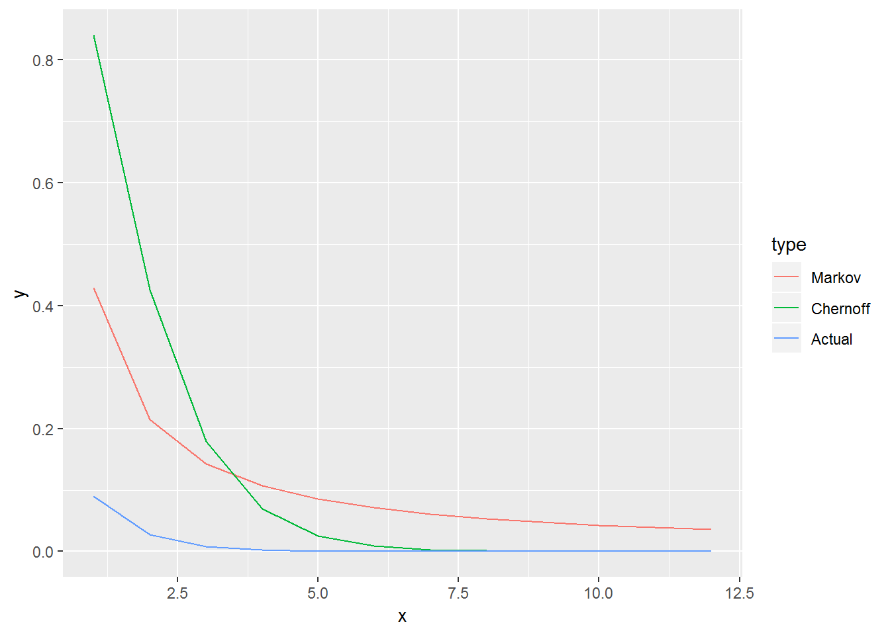
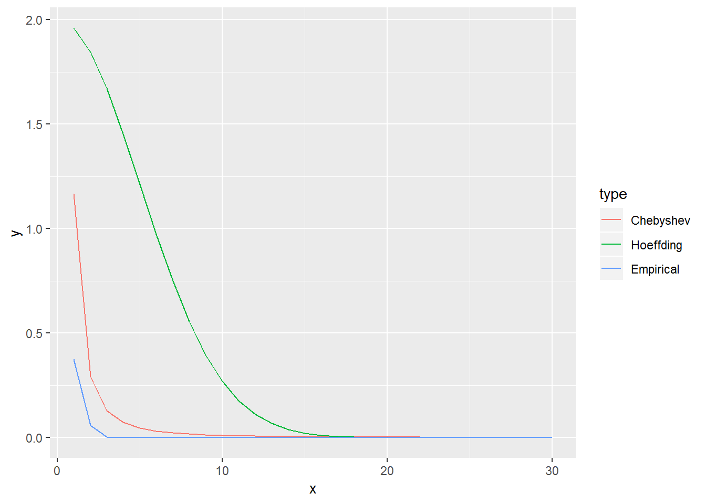
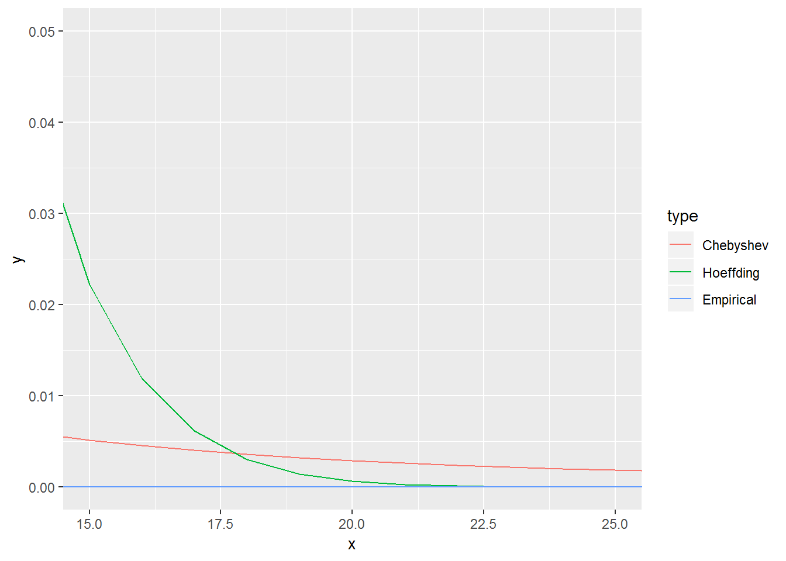

# Concentration inequalities {#ci}

This chapter deals with concentration inequalities.

The students are expected to acquire the following knowledge:

**Theoretical**

- More assumptions produce closer bounds.


**R**

- Optimization.
- Estimating probability inequalities.


## Comparison
\BeginKnitrBlock{exercise}<div class="exercise"><span class="exercise" id="exr:unnamed-chunk-2"><strong>(\#exr:unnamed-chunk-2) </strong></span><span style="color:blue">R: Let $X$ be geometric random variable with $p = 0.7$. Visually compare the Markov bound, Chernoff bound, and the theoretical probabilities. To get the best fitting Chernoff bound, you will need to optimize the bound depending on $t$. Use either analytical or numerical optimization.</span>
</div>\EndKnitrBlock{exercise}

```r
bound_chernoff <- function (t, p, a) {
  return ((p / (1 - exp(t) + p * exp(t))) / exp(a * t))
}

set.seed(1)
p <- 0.7
a <- seq(1, 12, by = 1)
ci_markov <- (1 - p) / p / a
t <- vector(mode = "numeric", length = length(a))
for (i in 1:length(t)) {
  t[i] <- optimize(bound_chernoff, interval = c(0, log(1 / (1 - p))), p = p, a = a[i])$minimum
}
t
```

```
##  [1] 0.5108267 0.7984981 0.9162927 0.9808238 1.0216635 1.0498233 1.0704327
##  [8] 1.0861944 1.0986159 1.1086800 1.1169653 1.1239426
```

```r
ci_chernoff <- (p / (1 - exp(t) + p * exp(t))) / exp(a * t)
actual      <- 1 - pgeom(a, 0.7)
plot_df     <- rbind(
  data.frame(x = a, y = ci_markov, type = "Markov"),
  data.frame(x = a, y = ci_chernoff, type = "Chernoff"),
  data.frame(x = a, y = actual, type = "Actual")
)
ggplot(plot_df, aes(x = x, y = y, color = type)) +
  geom_line()
```




\BeginKnitrBlock{exercise}<div class="exercise"><span class="exercise" id="exr:unnamed-chunk-4"><strong>(\#exr:unnamed-chunk-4) </strong></span><span style="color:blue">R: Let $X$ be a sum of 100 Beta distributions with random parameters. Take 1000 samples and plot the Chebyshev bound, Hoeffding bound, and the empirical probabilities.</span>
</div>\EndKnitrBlock{exercise}

```r
set.seed(1)
nvars   <- 100
nsamps  <- 1000
samps   <- matrix(data = NA, nrow = nsamps, ncol = nvars)
Sn_mean <- 0
Sn_var  <- 0
for (i in 1:nvars) {
  alpha1  <- rgamma(1, 10, 1)
  beta1   <- rgamma(1, 10, 1)
  X       <- rbeta(nsamps, alpha1, beta1)
  Sn_mean <- Sn_mean + alpha1 / (alpha1 + beta1)
  Sn_var  <- Sn_var + 
    alpha1 * beta1 / ((alpha1 + beta1)^2 * (alpha1 + beta1 + 1))
  
    samps[ ,i] <- X
}
mean(apply(samps, 1, sum))
```

```
## [1] 51.12511
```

```r
Sn_mean
```

```
## [1] 51.15723
```

```r
var(apply(samps, 1, sum))
```

```
## [1] 1.170652
```

```r
Sn_var
```

```
## [1] 1.166183
```

```r
a            <- 1:30
b            <- a / sqrt(Sn_var)
ci_chebyshev <- 1 / b^2
ci_hoeffding <- 2 * exp(- 2 * a^2 / nvars)
empirical    <- NULL
for (i in 1:length(a)) {
  empirical[i] <- sum(abs((apply(samps, 1, sum)) - Sn_mean) >= a[i])/ nsamps
}

plot_df     <- rbind(
  data.frame(x = a, y = ci_chebyshev, type = "Chebyshev"),
  data.frame(x = a, y = ci_hoeffding, type = "Hoeffding"),
  data.frame(x = a, y = empirical, type = "Empirical")
)

ggplot(plot_df, aes(x = x, y = y, color = type)) +
  geom_line()
```



```r
ggplot(plot_df, aes(x = x, y = y, color = type)) +
  geom_line() +
  coord_cartesian(xlim = c(15, 25), ylim = c(0, 0.05))
```



## Practical
\BeginKnitrBlock{exercise}<div class="exercise"><span class="exercise" id="exr:unnamed-chunk-6"><strong>(\#exr:unnamed-chunk-6) </strong></span>FROM BINDER. Let $X_i$, $i = 1,...n$, be a random sample of size $n$ of a random variable $X$. Let $X$ have mean $\mu$ and variance $\sigma^2$. Find the size of the sample $n$ required so that the probability that the difference between sample mean and true mean is smaller than $\frac{\sigma}{10}$ is at least 0.95. Hint: Derive a version of the Chebyshev inequality for $P(|X - \mu| \geq a)$ using Markov inequality.
</div>\EndKnitrBlock{exercise}
\BeginKnitrBlock{solution}<div class="solution">\iffalse{} <span class="solution"><em>Solution. </em></span>  \fi{}Let $\bar{X} = \sum_{i=1}^n X_i$. Then $E[\bar{X}] = \mu$ and $Var[\bar{X}] = \frac{\sigma^2}{n}$. Let us first derive another representation of Chebyshev inequality.
\begin{align}
  P(|X - \mu| \geq a) = P(|X - \mu|^2 \geq a^2) \leq \frac{E[|X - \mu|^2]}{a^2} = \frac{Var[X]}{a^2}.
\end{align}
Let us use that on our sampling distribution:
\begin{align}
  P(|\bar{X} - \mu| \geq \frac{\sigma}{10}) \leq \frac{100 Var[\bar{X}]}{\sigma^2} = \frac{100 Var[X]}{n \sigma^2} = \frac{100}{n}.
\end{align}
We are interested in the difference being smaller, therefore
\begin{align}
P(|\bar{X} - \mu| < \frac{\sigma}{10}) = 1 - P(|\bar{X} - \mu| \geq \frac{\sigma}{10}) \geq 1 - \frac{100}{n} \geq 0.95.
\end{align}
It follows that we need a sample size of $n \geq \frac{100}{0.05} = 2000$.

</div>\EndKnitrBlock{solution}
